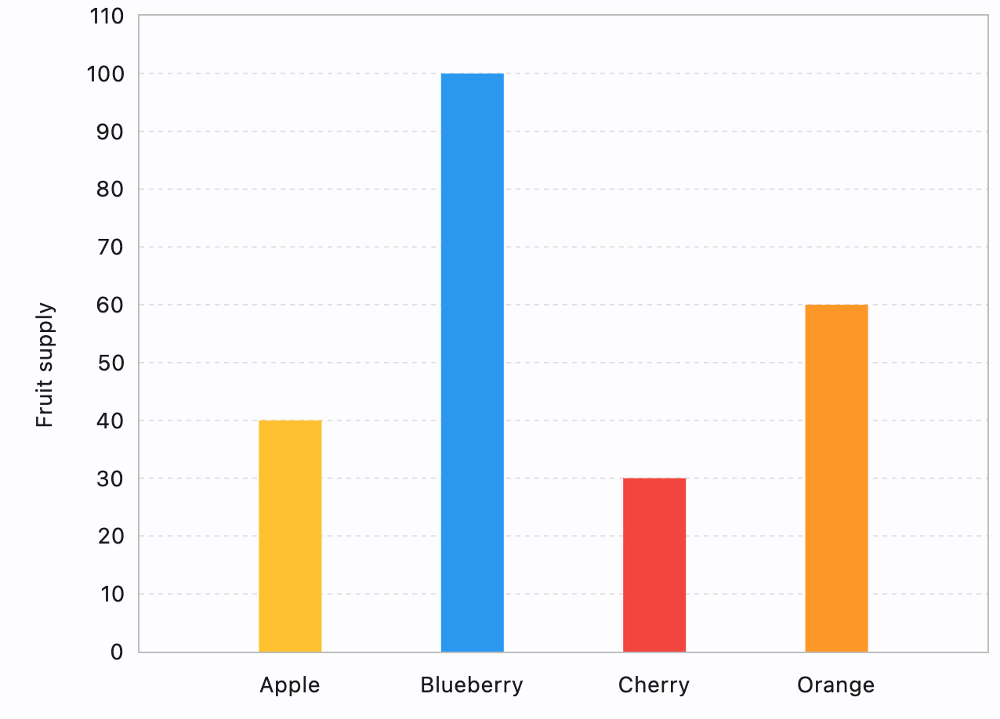

## Examples

### Example 1



```python
--8<-- "examples/charts_example/src/bar_chart/example_1.py"
```

### Example 2


```python
--8<-- "examples/charts_example/src/bar_chart/example_2.py"
```

::: flet_charts.bar_chart.BarChart
