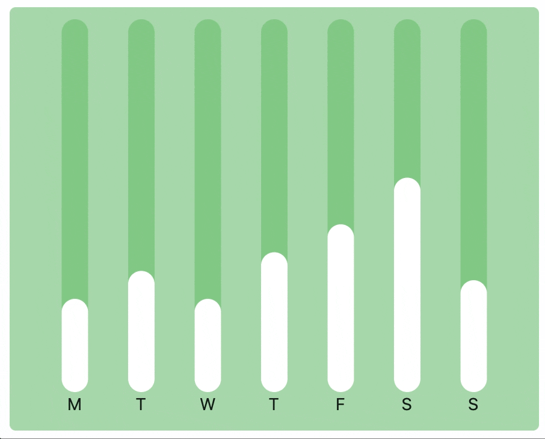

{{ class_summary(class_name, screenshot) }}

## Examples

### Example 1

{width="80%"}
/// caption
///

```python
--8<-- "examples/charts_example/src/bar_chart/example_1.py"
```

### Example 2

{width="80%"}
/// caption
///

```python
--8<-- "examples/charts_example/src/bar_chart/example_2.py"
```

{{ class_members(class_name) }}