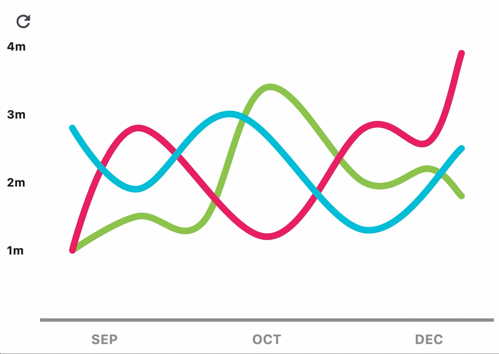
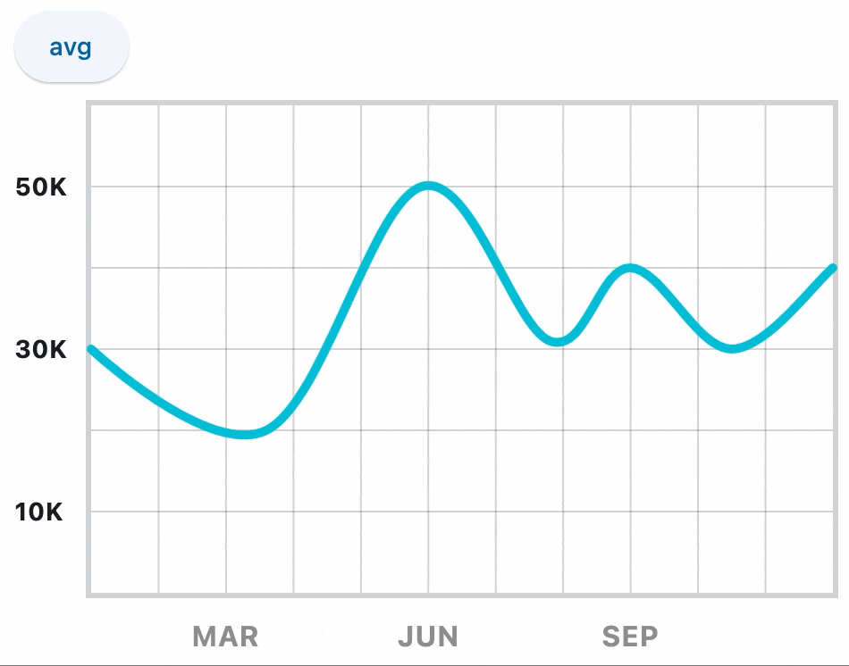

## Examples



### Example 1

```python
--8<-- "examples/charts_example/src/line_chart/example_1.py"
```

### Example 2



```python
--8<-- "examples/charts_example/src/line_chart/example_2.py"
```

::: flet_charts.line_chart.LineChart
