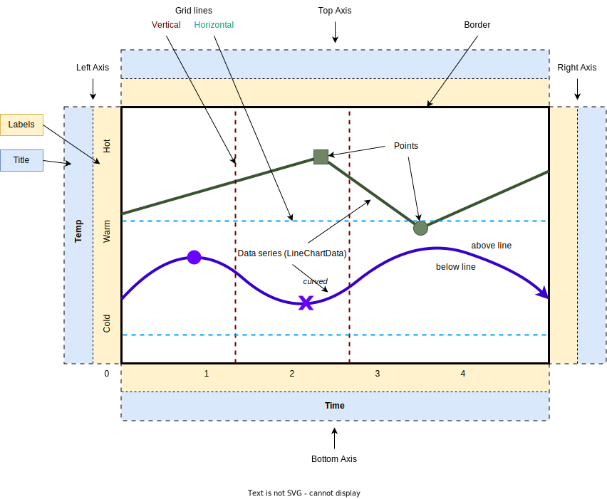

::: flet_charts.line_chart.LineChart
    options:
        show_root_toc_entry: true
        extra:
            show_class_docstring: true



::: flet_charts.line_chart.LineChart
    options:
        show_bases: true
        summary:
            attributes: true
            functions: true

## Examples

### Example 1

{width="80%"}
/// caption
///

```python
--8<-- "examples/charts_example/src/line_chart/example_1.py"
```

### Example 2

{width="80%"}
/// caption
///

```python
--8<-- "examples/charts_example/src/line_chart/example_2.py"
```

::: flet_charts.line_chart.LineChart
    options:
        extra:
            show_children: true