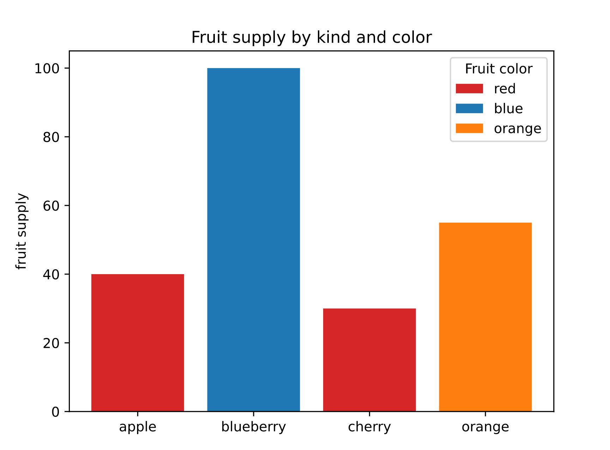
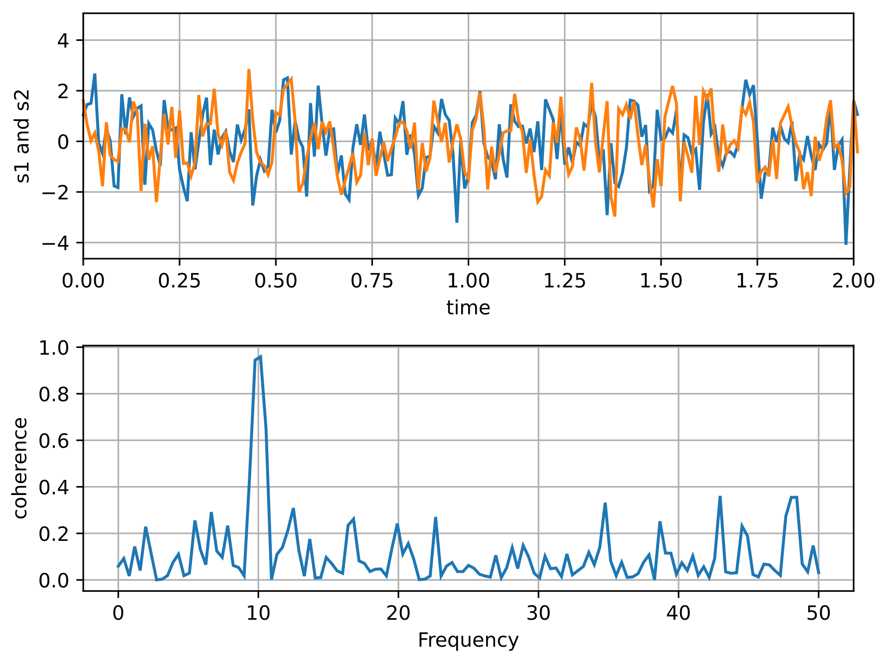

## Examples

### Example 1

Based on an
official [Matplotlib example](https://matplotlib.org/stable/gallery/lines_bars_and_markers/bar_colors.html#sphx-glr-gallery-lines-bars-and-markers-bar-colors-py).

{width="80%"}
/// caption
///

```python
--8<-- "examples/charts_example/src/matplotlib_chart/example_1.py"
```

### Example 2

Based on an
official [Matplotlib example](https://matplotlib.org/stable/gallery/lines_bars_and_markers/cohere.html#sphx-glr-gallery-lines-bars-and-markers-cohere-py).

{width="80%"}
/// caption
///

```python
--8<-- "examples/charts_example/src/matplotlib_chart/example_2.py"
```

::: flet_charts.matplotlib_chart.MatplotlibChart
