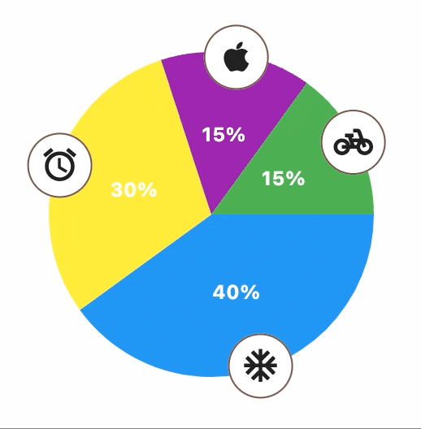

::: flet_charts.pie_chart.PieChart

## Examples

### Example 1


```python
--8<-- "examples/charts_example/src/pie_chart/example_1.py"
```

### Example 2


```python
--8<-- "examples/charts_example/src/pie_chart/example_2.py"
```

### Example 3



```python
--8<-- "examples/charts_example/src/pie_chart/example_3.py"
```
