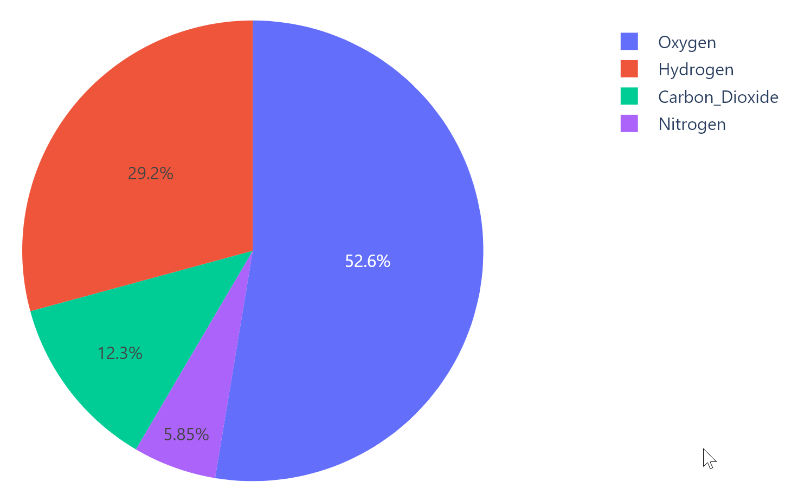
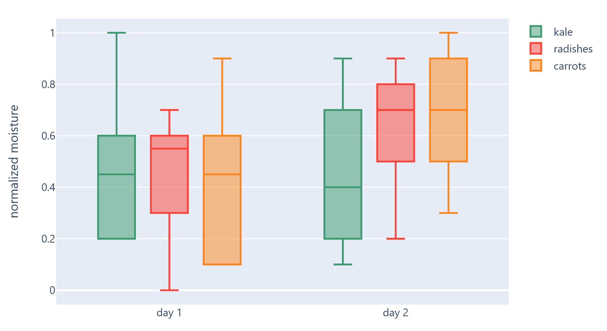

::: flet_charts.plotly_chart.PlotlyChart
    options:
        filters:
          - "!(init|before_update)"
        summary:
            attributes: true
            functions: true
        extra:
            show_children: false

## Examples

### Example 1

Based on an official [Plotly example](https://plotly.com/python/line-charts).

{width="80%"}
/// caption
///

```python
--8<-- "examples/charts_example/src/plotly_chart/example_1.py"
```

### Example 2

Based on an official [Plotly example](https://plotly.com/python/bar-charts).

{width="80%"}
/// caption
///

```python
--8<-- "examples/charts_example/src/plotly_chart/example_2.py"
```

### Example 3

Based on an official [Plotly example](https://plotly.com/python/pie-charts).

{width="80%"}
/// caption
///

```python
--8<-- "examples/charts_example/src/plotly_chart/example_3.py"
```

### Example 4

Based on an official [Plotly example](https://plotly.com/python/box-plots).

{width="80%"}
/// caption
///

```python
--8<-- "examples/charts_example/src/plotly_chart/example_4.py"
```

::: flet_charts.plotly_chart.PlotlyChart
    options:
        filters:
          - "!(init|before_update)"
        show_bases: false
        extra:
            show_class_docstring: false