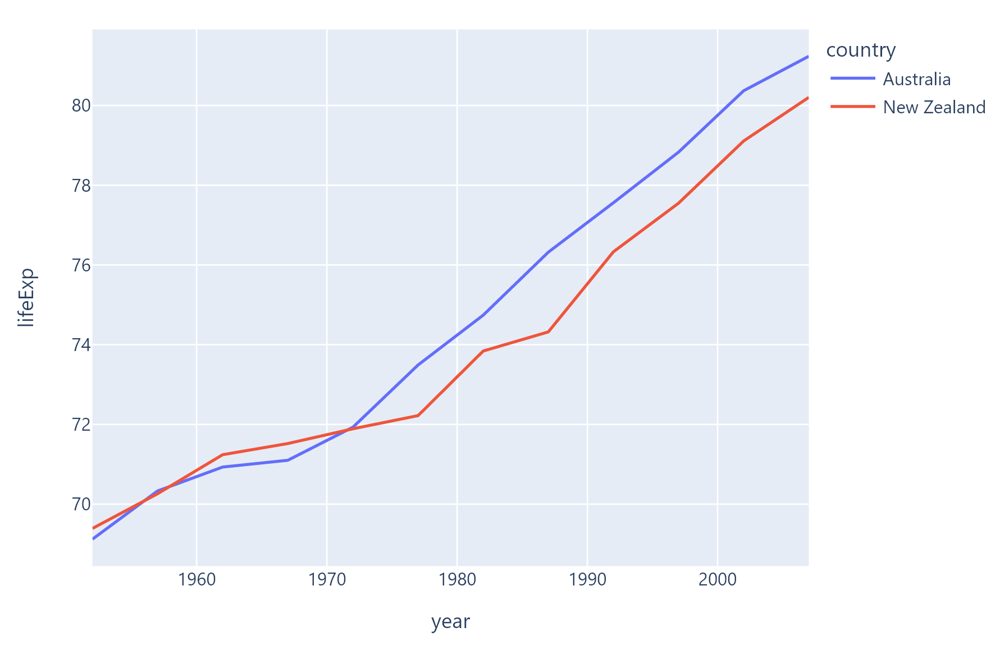
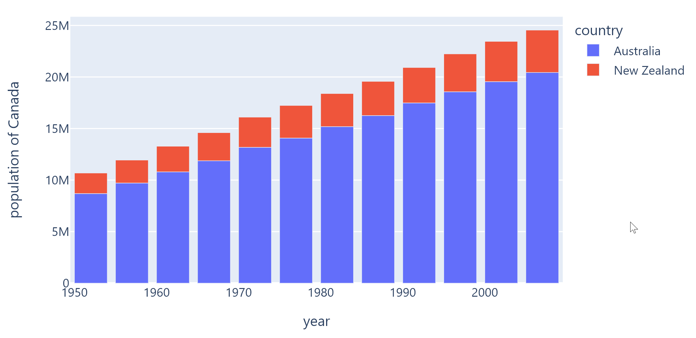

::: flet_charts.plotly_chart.PlotlyChart

## Examples

### Example 1

Based on an official [Plotly example](https://plotly.com/python/line-charts).



```python
--8<-- "examples/charts_example/src/plotly_chart/example_1.py"
```

### Example 2

Based on an official [Plotly example](https://plotly.com/python/bar-charts).



```python
--8<-- "examples/charts_example/src/plotly_chart/example_2.py"
```

## Example 3

Based on an official [Plotly example](https://plotly.com/python/pie-charts).


```python
--8<-- "examples/charts_example/src/plotly_chart/example_3.py"
```

### Example 4

Based on an official [Plotly example](https://plotly.com/python/box-plots).


```python
--8<-- "examples/charts_example/src/plotly_chart/example_4.py"
```